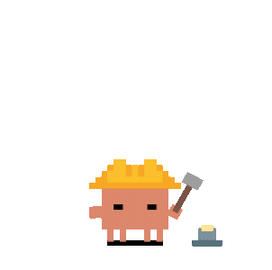
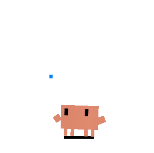
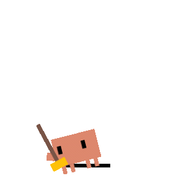
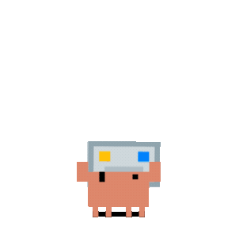
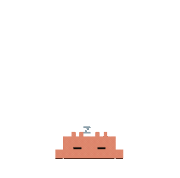
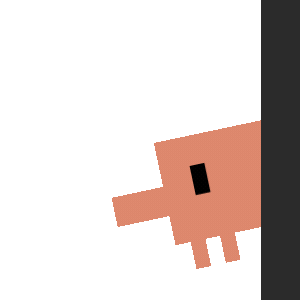
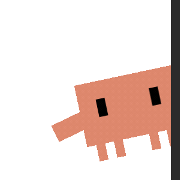
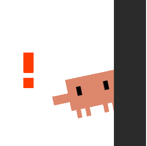
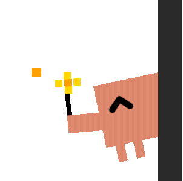

<p align="center">
  
</p>
<h1 align="center">🦀 Mr. Krabs — 你想拥有一个主动干活的 AI 吗？</h1>
<p align="center">
  一个帮你管理异步 To-Do List 的 AI 桌宠<br>
  它会自己领任务、自己干活、自己汇报
</p>
<p align="center">
  
  
  
</p>

---

**Mr. Krabs 的核心不是“更聪明的对话”，而是对任务的异步执行 + 主动推荐** —— 你不盯着，它也在干活。

<p align="center">
  
  
  
  
</p>

## 为什么做这个？

今天的 AI Agent 非常强大，但有三个致命缺陷：

- **不叫不动** —— 你不发 prompt，它就不干活
- **聊完就忘** —— 每次对话都是从零开始
- **看不见状态** —— 你不知道它在忙什么、卡在哪

Mr. Krabs 解决的核心问题是：**让 AI 像一个靠谱的实习生，你给方向，它自己安排工作、自己汇报**。

---

## ⭐ 核心能力：异步 To-Do List

Mr. Krabs 的核心是一份 `~/.mr-krabs/tasks.md`，两条腿走路：**你给任务** 和 **它自己想任务**。两者都走异步执行 —— 提交后你做别的事，Mr. Krabs 在后台跑，完成了再找你。

### 📋 To-Do List 任务流

```
你（用户）                              Mr. Krabs

划词选中一段文字                        空闲时 / 定时触发
  → 浮窗弹出“加入任务”    ──────>      自动领取 → 后台执行 → 交付结果
                                        ↓ 完成后通知你
快捷键 Cmd+Shift+T
  → 输入一句话进清单       ──────>      同上

给一个方向
  “盯竞品动态”             ──────>      持续执行 → 定期更新 → 有变化主动告诉你
```

### 📌 五种任务状态

| 标记 | 状态 | 说明 |
|:----:|------|------|
| `[ ]` | 待执行 | 你下达的、或你采纳的建议 |
| `[~]` | 执行中 | Mr. Krabs 正在处理 |
| `[!]` | 待审阅 | 做完了但不太有把握，等你过目 |
| `[x]` | 已完成 | 搞定了 |
| `[?]` | 建议中 | Mr. Krabs 主动提议，**你采纳才执行** |

### 🤖 主动推荐：它自己想任务

Mr. Krabs 不只是等你吩咐。每 **4 小时**（首次启动后 10 分钟），它会自动分析你的工作上下文，主动提议 1-3 个它认为你应该做的事。

| 信号源 | 说明 |
|--------|------|
| 对话历史 | 你最近在聊什么、问什么 |
| 项目上下文 | 你最近在忙哪些项目 |
| 浏览/阅读笔记 | 你手动记的阅读笔记 |
| 技术热点 | Hacker News 等社区的实时动态 |
| 兴趣画像 | 你长期关注的方向（权重排序） |
| 任务状态 | 当前待办、已完成、活跃会话 |

> **核心设计：Mr. Krabs 可以主动想，但不能主动干，决定权在你。**
> 提议写入任务清单的 `[?]` 状态 —— 你采纳了才进执行队列。

### ⏰ 空闲自治执行

Mr. Krabs 睡着 = 你不忙。它自动醒来，按优先级从清单里取任务，启动独立 Claude 会话执行。每个任务独立 agent，互不干扰。

除空闲触发外，任务队列也会在每天 **02:00** 和 **14:00** 自动定时运行。

### 📦 分级交付

任务完成后，Mr. Krabs 根据信心程度自动决定怎么交付：

| 结果 | 行为 |
|------|------|
| **搞定了** (confidence ≥ 0.7) | 静默存档，标记待审阅 `[!]`，不打扰 |
| **没完全搞定** | 自动反思迭代一轮，把最好的结果交付；给个小提示 |
| **真的需要你** | 弹窗写清缺什么信息，你填完它接着跑 |

---

## 🧠 它怎么越用越懂你

异步执行要做得好，光有任务队列不够 —— Mr. Krabs 还需要记住你是谁、理解你关心什么、学会你的做事方式。

### 三级记忆存储

| 层级 | 比喻 | 作用 |
|------|------|------|
| **L1 · 任务清单** | 便利贴墙 | 当前在做什么，实时更新 |
| **L2 · 执行摘要** | 工作日志 | 每个任务完成后自动提炼要点，下次任务注入最近 3 条，保持上下文连贯 |
| **L3 · 长期知识库** | 图书馆 | 按主题分文件存储，两阶段检索 —— 先查索引、再精准取用 |

### 兴趣画像

Mr. Krabs 通过你的行为推断你关注什么：

- **主动提问**是最强信号（×3.0）
- **划词追问**次之（×2.0）
- **外部热点**最弱（×1.0）

兴趣随时间衰减 —— 一周前的权重只剩一半，一个月前接近清零。你采纳建议，话题权重上升；你拒绝，权重下降。**画像越来越准，提议越来越对。**

### 技能卡片：经验沉淀

每个任务完成后，自动提炼可复用经验存成卡片：

- **方法论**：做事步骤（全局通用）
- **偏好**：你的工作习惯（全局通用）
- **踩坑记录**：曾经出过的问题（⚠️ 高亮警告，确保不踩第二次）
- **约定**：特定项目里的规矩

下次遇到类似任务，自动注入对应卡片。**你不需要重复教它。**

---

## 📡 Context 从哪来

Mr. Krabs 住在 OS 层，能从你的工作流里自己捡到线索：

| 通道 | 做什么 |
|------|--------|
| **划词 + 浮窗** ⭐ | 浏览器/编辑器中选中文字 → 一键加入任务清单，连同上下文一起 |
| **快捷键** ⭐ | `Cmd+Shift+T` → 脑子里的想法直接进清单 |
| **OS 感知** ⭐ | 自动感知当前项目、待办、近期动作，定期做上下文快照 |
| 对话历史 / 浏览笔记 | 辅助上下文，丰富提议质量 |

---

## 🦀 Always On：桌宠状态感知

Mr. Krabs 是个桌宠 —— 它坐在你桌面上，你抬头就能看到它在忙什么。**40 个像素风动画**映射 Agent 状态，不需要打开 dashboard。

桌宠形态解决三个问题：

1. **Agent 需要常驻但不能硷事** — 桌宠天然常驻屏幕但不占窗口
2. **用户需要敢放手** — 拟人化降低自治执行的心理门槛
3. **状态需要零成本感知** — 动画是最低认知负担的 observability

### 状态映射

| 发生了什么 | 蟃蟃的反应 | 动画 |
|-----------|-----------|------|
| 你提交了 prompt | 思考泡泡 |  |
| 工具在跑 | 打字 |  |
| 3+ 会话并发 | 建造 |  |
| 子代理启动 | 杂耍 / 指挥 |  |
| 工具报错 | ERROR + 冒烟 |  |
| 任务完成 | 开心蹦跳 |  |
| 需要权限 | 气泡弹窗 → 一键审批 |  |
| 压缩上下文 | 扫帚清扫 |  |
| 创建 worktree | 搬箱子 |  |
| 什么都没发生 | 眼球追踪鼠标 |  |
| 60 秒空闲 | 打哈欠 → 睡着 |  |

### Mini 模式

把 Mr. Krabs 拖到屏幕右侧边缘（或右键菜单 → “Mini Mode”），蟃蟃会藏在屏幕边缘，鼠标悬停时探头打招呼：

| 触发 | 反应 | 动画 |
|------|------|------|
| 默认 | 呼吸 + 眨眼 + 偶尔挥手 |  |
| 鼠标悬停 | 探头 + 挥手 |  |
| 有通知 | 感叹号 + 眷眼 |  |
| 任务完成 | 开心 + 花花 |  |

---

## 🚀 Quick Start

### 一键安装（推荐）

```bash
curl -fsSL https://raw.githubusercontent.com/melisaliao502-debug/mr-krabs/main/install.sh | bash
```

自动检测系统/架构，下载最新版本并启动。支持 macOS (Intel & Apple Silicon) 和 Windows。

### 从源码运行（开发者）

```bash
git clone https://github.com/melisaliao502-debug/mr-krabs.git
cd mr-krabs
npm install
npm start
```

### Agent 配置

- **Claude Code** — 开箱即用，启动时自动注册 hooks
- **Codex CLI** — 开箱即用，自动轮询 `~/.codex/sessions/` 日志
- **Copilot CLI** — 需手动创建 `~/.copilot/hooks/hooks.json`（详见下方）

<details>
<summary>Copilot CLI hooks 配置</summary>

创建 `~/.copilot/hooks/hooks.json`：

```json
{
  "version": 1,
  "hooks": {
    "sessionStart": [{ "type": "command", "bash": "node /path/to/mr-krabs/hooks/copilot-hook.js sessionStart", "timeoutSec": 5 }],
    "userPromptSubmitted": [{ "type": "command", "bash": "node /path/to/mr-krabs/hooks/copilot-hook.js userPromptSubmitted", "timeoutSec": 5 }],
    "preToolUse": [{ "type": "command", "bash": "node /path/to/mr-krabs/hooks/copilot-hook.js preToolUse", "timeoutSec": 5 }],
    "postToolUse": [{ "type": "command", "bash": "node /path/to/mr-krabs/hooks/copilot-hook.js postToolUse", "timeoutSec": 5 }],
    "sessionEnd": [{ "type": "command", "bash": "node /path/to/mr-krabs/hooks/copilot-hook.js sessionEnd", "timeoutSec": 5 }]
  }
}
```

将 `/path/to/mr-krabs` 替换为实际安装路径。

</details>

### macOS 注意

DMG 安装包未签名 —— 右键 → **打开** → 点击 **打开**，或运行 `xattr -cr "/Applications/Mr. Krabs.app"`。

---

## 🏗 系统架构

```
主动任务系统:
  Context 输入（划词 / 快捷键 / OS 感知 / Claude 历史）
    → ~/.mr-krabs/tasks.md（统一任务队列）
    → tasks.js（空闲检测 / 定时触发 → 启动 Claude 会话执行）
    → 信心分级交付（自动完成 / 反思重试 / 向用户提问）
    → 技能提取 → ~/.mr-krabs/skills/*.md（下次自动注入）

  Context Monitor（4 小时周期）:
    → 采集快照（对话 + 会话 + 笔记 + 热点 + 兴趣画像）
    → Claude 分析 → 提议 1-3 条 [?] 建议

实时状态感知:
  Claude Code / Copilot CLI（command hooks，非阻塞）:
    Agent 事件
      → hooks/mr-krabs-hook.js（事件 → 状态 → HTTP POST）
      → 127.0.0.1:23333/state
      → 状态机 → IPC → SVG 动画切换

  Codex CLI（JSONL 日志轮询）:
    → agents/codex-log-monitor.js → 同一状态机 → 同一动画

  权限审批（Claude Code HTTP hook，阻塞）:
    → 127.0.0.1:23333/permission → 气泡弹窗 → 用户一键审批
```

---

## 📁 项目结构

```
src/
  main.js              # Electron 主进程：状态机、窗口、托盘、任务集成
  renderer.js          # 渲染器：拖拽、点击、SVG 动画、眼球追踪
  tasks.js             # 任务引擎：队列、执行、交付、技能、记忆
  context-monitor.js   # Context Monitor：周期分析 + 主动提议
  task-panel.html      # 任务面板（状态看板）
  quick-task.html      # 快速输入（Spotlight 风格，Cmd+Shift+T）
  bubble.html          # 权限审批气泡
  chat.html            # 划词浮窗
agents/
  claude-code.js       # Claude Code agent 配置
  codex.js             # Codex CLI agent 配置
  copilot-cli.js       # Copilot CLI agent 配置
  codex-log-monitor.js # Codex JSONL 日志轮询
hooks/
  mr-krabs-hook.js     # Claude Code command hook
  copilot-hook.js      # Copilot CLI command hook
  install.js           # Hook 自动注册
  auto-start.js        # SessionStart：自动启动 Mr. Krabs
assets/
  svg/                 # 40 个像素风 SVG 动画（含 8 个 mini 模式）
  gif/                 # 文档用 GIF 录制
```

---

## 鸣谢

- 状态感知层的基础工作来源于 [Github 社区共建](https://github.com/rullerzhou-afk/clawd-on-desk)
- 像素画参考自 [clawd-tank](https://github.com/marciogranzotto/clawd-tank) by [@marciogranzotto](https://github.com/marciogranzotto)
- Clawd 角色归属 [Anthropic](https://www.anthropic.com)，本项目为社区项目，非 Anthropic 官方出品

## License

MIT
